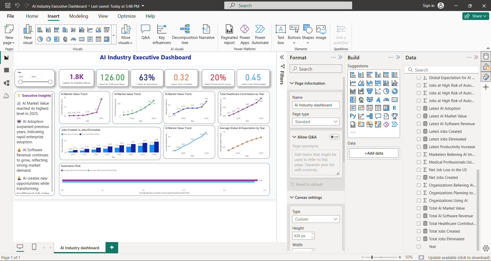

# 🤖 AI Industry Executive Dashboard

An end-to-end Power BI dashboard analyzing AI industry growth, enterprise adoption, software revenue, workforce transformation, healthcare contribution, and automation trends using Power Query, Data Modeling, and DAX.

---

# 📌 Project Overview

Artificial Intelligence is transforming industries worldwide. This project analyzes key AI trends from 2018–2025 and presents them through an interactive executive dashboard built in Power BI.

The dashboard enables users to monitor AI market growth, software revenue, enterprise adoption, workforce impact, healthcare contributions, and automation risks to support data-driven decision-making.

---

# 🎯 Business Objective

Develop an interactive executive dashboard that enables stakeholders to:

- Monitor AI market growth
- Track AI software revenue
- Analyze AI adoption trends
- Evaluate workforce transformation
- Understand healthcare contribution
- Identify automation risks
- Generate business insights

---

# 🛠️ Tools & Technologies

- Power BI Desktop
- Power Query
- DAX
- Data Modeling
- Microsoft Excel / CSV

---

# 📊 Dashboard Features

- Executive KPI Cards
- Interactive Slicers
- Trend Analysis
- AI Adoption Dashboard
- Workforce Analysis
- Healthcare Analysis
- Automation Risk Analysis
- Business Insights Panel

---

# 📈 KPIs

- AI Market Value
- AI Software Revenue
- AI Adoption
- Jobs Created
- Jobs Eliminated
- Employee Productivity
- Healthcare Contribution
- Organizations Using AI
- Global AI Expectations

---

# 📂 Project Workflow

Raw Dataset

⬇️

Power Query

⬇️

Data Cleaning

⬇️

Data Modeling

⬇️

DAX Measures

⬇️

Dashboard Development

⬇️

Business Insights

---

# 🧹 Data Preparation

The dataset was prepared using Power Query.

Tasks performed:

- Verified data types
- Checked duplicate records
- Checked missing values
- Validated numerical columns
- Built a Date table
- Created relationships

---

# 📐 Data Model

The dashboard follows a simple star schema.

- Fact Table
  - AI Industry Dataset

- Dimension Table
  - Date Table

Relationships were created to support filtering and time-based analysis.

---

# 📊 Dashboard Preview




# 💡 Executive Insights

- AI market value has grown steadily over the years.
- AI adoption continues to increase across industries.
- AI software revenue shows strong growth.
- Healthcare is among the fastest-growing AI sectors.
- Automation risk remains highest in manufacturing and retail.

---

# 📋 Business Recommendations

- Continue investing in AI technologies.
- Prioritize employee upskilling.
- Expand AI adoption across business operations.
- Increase AI investment in healthcare.
- Prepare high-risk industries for workforce transformation.

---

# 💼 Skills Demonstrated

- Data Cleaning
- Power Query
- Data Modeling
- Star Schema
- DAX
- KPI Development
- Dashboard Design
- Data Visualization
- Business Analysis
- Insight Generation

---

# 📁 Repository Structure

```text
AI-Industry-PowerBI-Dashboard
│
├── Dashboard
├── Dataset
├── Docs
├── Images
├── README.md
└── LICENSE
```

---

# 🚀 Future Improvements

- Add Year-over-Year (YoY) Analysis
- Implement Time Intelligence
- Add Drill-through Pages
- Publish to Power BI Service
- Connect to SQL Database
- Build Mobile Layout

---

# 📄 License

This project is licensed under the MIT License.

---

⭐ If you found this project helpful, consider giving it a star!
